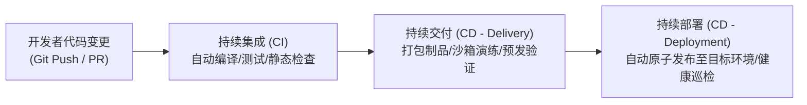
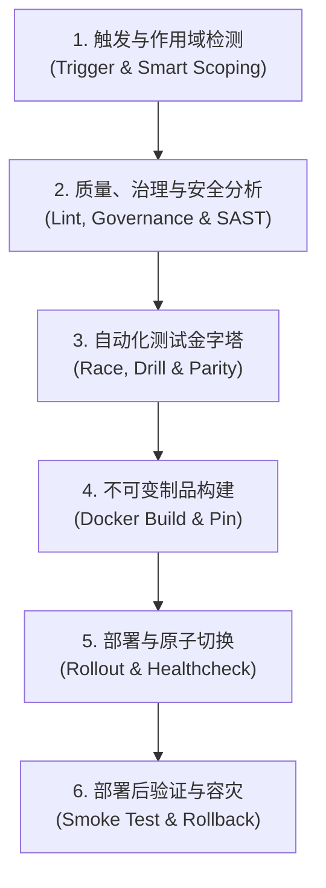
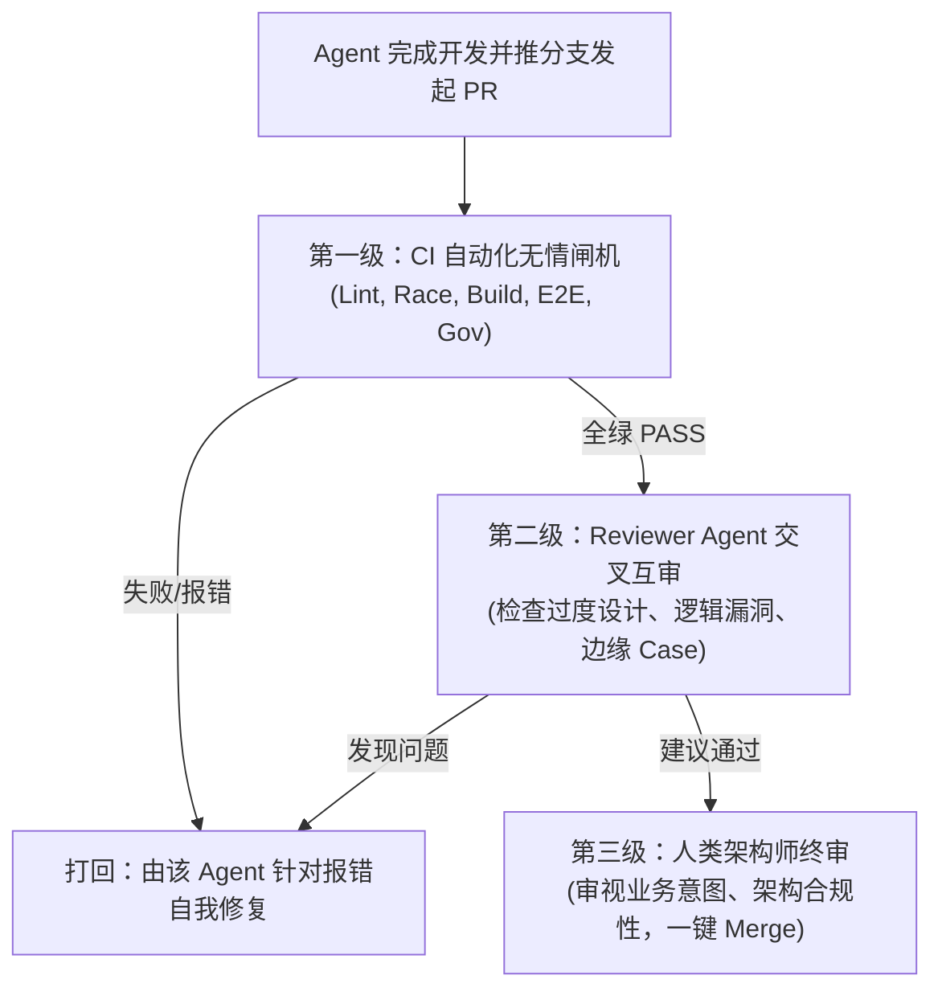

# 多 Agent 协同研发与 CI/CD 流水线实践指南

本指南系统性阐明了现代多 AI Agent（如 Antigravity、Codex、Claude 等）协同开发体系、Git/PR 治理模型与 CI/CD 自动化流水线工程实践，供团队工程师与 Agent 学习查阅。

---

## 目录
1. [CI 与 CD 的核心概念与本质](#一ci-与-cd-的核心概念与本质)
2. [工业级 CI/CD 流水线的六大生命周期阶段](#二工业级-cicd-流水线的六大生命周期阶段)
3. [深入理解 PR（Pull Request）的四大核心身份](#三深入理解-prpull-request的四大核心身份)
4. [多 AI Agent 协同研发管理规范（工程实战）](#四多-ai-agent-协同研发管理规范工程实战)
5. [“机-机-人”三级代码审查与交付漏斗](#五机-机-人三级代码审查与交付漏斗)
6. [分支管理与主干保护策略（Squash and Merge）](#六分支管理与主干保护策略squash-and-merge)

---

## 一、CI 与 CD 的核心概念与本质



### 1. 持续集成（Continuous Integration, CI）
- **目标**：解决“集成地狱”（Integration Hell）。过去开发人员各自写数周代码，合并时产生灾难级冲突与隐蔽 Bug。
- **机制**：要求开发者频繁将小步代码合入主干（通常每天多次）。代码一经推送或发起 PR，自动化系统立即拉起沙箱执行依赖安装、语法分析、竞态测试与单元测试，快速暴露集成问题。
- **守则**：合并前必须保证 CI“全绿”；主干若变红，修复主干拥有最高优先级。

### 2. 持续交付（Continuous Delivery, CD）
- **目标**：确保代码库随时具备部署到生产环境的能力。
- **机制**：代码通过 CI 后，流水线自动构建**不可变制品（Immutable Artifact）**（打上不可变 Commit SHA 标签的 Docker 镜像），并在隔离环境完成端到端 E2E 测试、协议兼容测试与数据迁移演练。
- **特征**：在正式发布生产前，通常保留一个**人工审批门禁（Approval Gate）**。

### 3. 持续部署（Continuous Deployment, CD）
- **目标**：持续交付的完全自动化闭环。
- **机制**：代码只要通过所有自动化测试与安全门禁，无需任何人工点击，流水线自动通过镜像流式部署到测试或生产集群。
- **前提**：必须具备完备的健康探针（Healthcheck）与秒级自动回滚能力（Automatic Rollback）。

---

## 二、工业级 CI/CD 流水线的六大生命周期阶段



1. **触发与智能作用域（Trigger & Smart Scoping）**：
   - 识别变更文件路径。若仅改动文档或前端样式，自动跳过耗时的后端单测与迁移演练，实现分钟级极速反馈。
2. **代码质量、治理与安全扫描（Lint, Governance & SAST）**：
   - 静态分析：ESLint、golangci-lint、go vet。
   - 治理门禁：校验 80 项需求版本化事实源与 PR 结构元数据（`projectctl check`）。
   - 语义安全分析：CodeQL 污点追踪，防范 SQL 注入与 XSS。
   - 供应链安全：锁定 Actions 的 40 位不可变 Commit SHA，杜绝投毒。
3. **多维度自动化测试金字塔（Test Pyramid）**：
   - 并发竞态安全：Go 开启 `-race` 参数进行高并发死锁与数据争用检测。
   - 数据库迁移演练：验证 SQLite / MySQL Up & Down 脚本不破坏数据。
   - 协议与双跑对齐（Legacy Parity）：与旧系统 Oracle 容器进行差异比对测试。
4. **不可变制品构建（Immutable Artifact Packaging）**：
   - “Build Once, Deploy Anywhere”。同一次提交只编译一次，环境差异仅由 `.env` 注入。
5. **部署与健康探针（Rollout & Healthcheck）**：
   - 将新镜像流式载入服务器容器守护进程。
   - 轮询内部接口（如 `/healthz`），最长等待 60 秒确认容器报告 `healthy`。
6. **自动回滚与公网冒烟（Rollback & Smoke Test）**：
   - 若健康检查超时或崩溃，脚本捕获 `ERR` 信号自动回滚到上一版镜像快照。
   - 部署成功后，发起外网公网 HTTPS 探针检验，全绿后结束。

---

## 三、深入理解 PR（Pull Request）的四大核心身份

PR 绝不仅仅是一个“合并代码”的动作，它是研发协作的综合控制中心：

1. **代码的“聚光灯对比台”（Diff View）**：
   - 直观展示新旧代码每一行的增删改（红/绿高亮），帮助审查者在 3 分钟内抓住核心脉络。
2. **团队的技术讨论区与传帮带工场（Code Review）**：
   - 支持行级批注（Inline Comment），方便就具体设计、边缘异常或性能优化展开推敲。
3. **自动化机器人的“安检闸机”（CI Gatekeeper）**：
   - PR 发起瞬间，CI 机器人自动介入安检。只要有一项测试不通过，分支保护规则锁死合并按钮，确保垃圾或缺陷代码绝不污染主干。
4. **项目的“法律契约与责任追溯录”（Audit Trail）**：
   - 记录每次改动的始末：关联的 Issue、架构背景、讨论过程、批准人（LGTM），为系统长期维护提供不可篡改的上下文。

---

## 四、多 AI Agent 协同研发管理规范（工程实战）

在单机部署多个 AI Agent（Antigravity、Codex、Claude 等）时，必须执行严格的工程管控以防代码踩踏与逻辑混淆：

### 1. 物理工作树隔离（Git Worktree）
**严禁多个 Agent 在同一个本地工作树（Working Directory）内同时写代码。** 必须为不同 Agent 建立独立物理工作树：
```bash
# 为不同 Agent 检出独立工作目录，共享同一个底层 .git
git worktree add ../xboard-antigravity feat/admin-tabs
git worktree add ../xboard-codex fix/node-timeout
```

### 2. 带身份标识的分支命名规范
- 格式：`<agent-or-role>/<type>/<issue-id>-<short-description>`
- 示例：
  - `antigravity/feat/231-admin-tabs`
  - `codex/fix/205-repeat-purchase`

### 3. 任务排他认领与爆炸半径控制（Blast Radius Control）
- **单任务归属**：同一时刻，一个 Issue 仅分配给一个 Agent 负责。
- **范围红线**：Agent 仅修改与该任务强相关的目录与文件，严禁擅自执行跨模块重构、全局格式化或不必要的依赖升级。

### 4. 规范化提交（Conventional Commits & 原子提交）
- 严禁提交包含几十个文件的无意义大包（如 `update files`, `fix bug`）。
- 坚持“一个功能点 + 对应单测 = 一个原子提交”，格式严格为 `feat:`, `fix:`, `test:`, `docs:`, `chore:`。

---

## 五、“机 - 机 - 人”三级代码审查与交付漏斗



1. **第一级：CI 自动化闸机（机器把关）**
   - 机器对格式、竞态、单测、PR 元数据、构建进行客观校验。CI 不过，人类与 Reviewer Agent 无需介入。
2. **第二级：Reviewer Agent 交叉互审（AI 把关）**
   - 专职 Reviewer Agent 读取 PR Diff，排查潜在边界异常、空指针风险与过度设计。
3. **第三级：人类架构师终审（人类把关）**
   - 人类只聚焦于**业务目标符合度与架构演进方向**，确认后点击合并。

---

## 六、分支管理与主干保护策略（Squash and Merge）

1. **主干保护（Branch Protection Rules）**：
   - 仓库设置禁止任何人向 `main` 直接推送；
   - 必须通过 Pull Request 并全部通过必需的 CI Checks 才能合并。
2. **Squash and Merge（压缩合并）**：
   - 特性分支上 Agent 产生的大量临时、调试碎提交，在合入 `main` 时统一压缩为**单个高质量 Commit**；
   - 保持主干历史极其干净、线性，极大方便后续线上溯源与 `git bisect` 故障二分排查。
